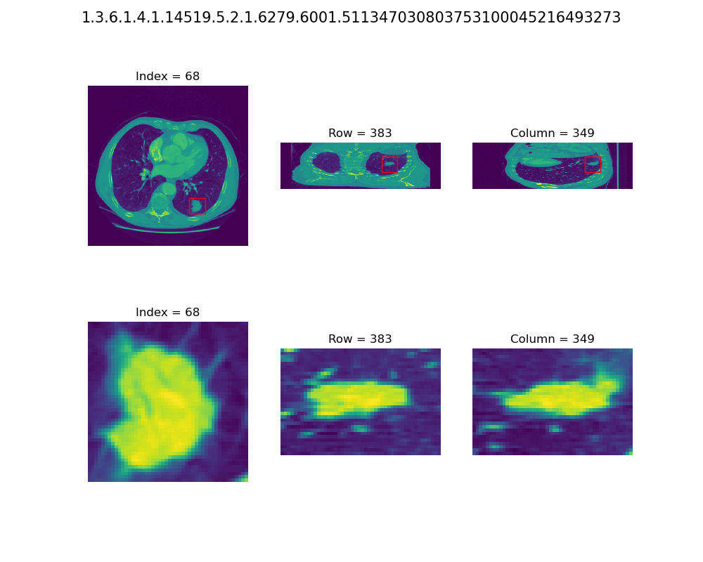

# Lung Cancer Detection
This repository is collection of different algorithms for:  
1. image classification  
1. instance segmentation
1. object detection  

as well as boiler-plate code for model/application deployment. 

## Goal
This is a pet project for building cv models from scratch instead of using built-in implementations from torchvision or simmilar model repository. Therefore next to each `model_name.py` file is `model_name.md` where I write notes about particular implementation.  
The goal **is not** to compare performance between those models because I'm lacking resources to fully test them (espcially methods on full CT scan)  
Additional goal is the deploy the model as application simmilar to what I would do in real world scenario and that would include tests/cicd/rest-api/model-repository but this is a secondary goal and I will include those parts as I go. 

## Algorithms
As of now following models are manually implemented:
1. classifiers
    - lenet
    - resnet
    - vgg
    - resnet
    - inception
    - senet
    - mobilenet
    - efficientnet
1. segmenation
    - unet
1. detections
    - YOLO v2 - [todo: autograd not converging]
    - YOLO v5 - [solo model]
    - R-CNN - [todo: build custom SVM which supports batch training]
    - Fast R-CNN
    - ultralytics/YOLOv8 [only implementation]
    - darknet/YOLO [only implementation]

**Next in line:**
1. classifiers:
    - Any Transofrmer based e.g. Swin Transformer
1. segmenation
    - MMDetections [only implementation]
    - YOLO-SAM [only implementation]
1. detections
    - Faster R-CNN
    - YOLOv5

## Data
Detailed description of the data is available here: https://luna16.grand-challenge.org  
What is imporatant is that full dataset containes only 888 CT scans and still takes over 100GB of space. This is why running it on "home resources" is a challange and free solutions like Google Colab are also require a bit of shenaningans. 

## Warm up
The idea for this project as well the base code is coming from book: [Deep Learning with PyTorch](https://www.manning.com/books/deep-learning-with-pytorch). I decided to start from well-structured project because I was lacking domain knowledge about CT scans and Nodule analysis which was crucial here. But their approach was only a stepping stone for me and If you wish you can see all my development above theirs comparing branches [branch-main](https://gitlab.com/ml.konopelski/lung_cancer_detection/-/tree/main) to [branch-version/1](https://gitlab.com/ml.konopelski/lung_cancer_detection/-/tree/version/1). 

## Example of lung cancer nodule

  
-----
## TODO
Personal nice-to-have TODO list for this project [unsorted]:  
[x] Retrain SegmentationApp to Save a model for LunaApp. Add little Augmentations. EPOCHS: 30 GPU  
[ ] Resize example image on axis 1, 2 so it is not skewed when using 1:1:1 ratio between axes.
[ ] Build more automatic/torch way of Augmentations instead of manual transformations  
[ ] Apply elastic deformations, where we put “digital crumples” into the inputs http://mng.bz/Md5Q .  
[ ] Apply Unsupervised Data Augmentation for Consistency Training https://arxiv.org/abs/ 1904.12848  
[ ] Read: Second-place solution write-up by Daniel Hammack and Julian de Wit: http:// mng.bz/Md48  
[ ] Read: Ninth-place solution write-up by Team Deep Breath: http://mng.bz/aRAX  
[ ] Read: Deep Learning to Achieve Clinically Applicable Segmentation of Head and Neck Anatomy for Radiotherapy, https://arxiv.org/pdf/1809.04430.pdf  
[ ] Read: Automatic lung segmentation from thoracic computed tomography scans using a hybrid approach with error detection https://aapm.onlinelibrary.wiley.com/doi/abs/10.1118/1.3147146